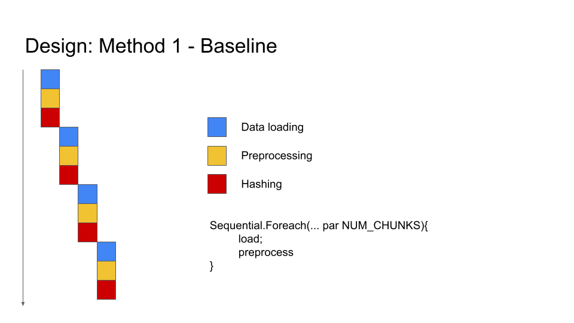
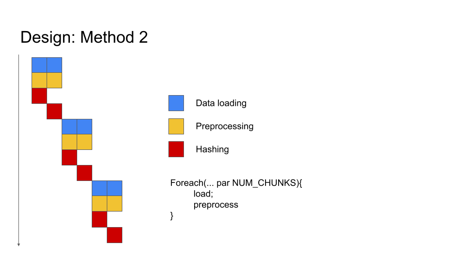
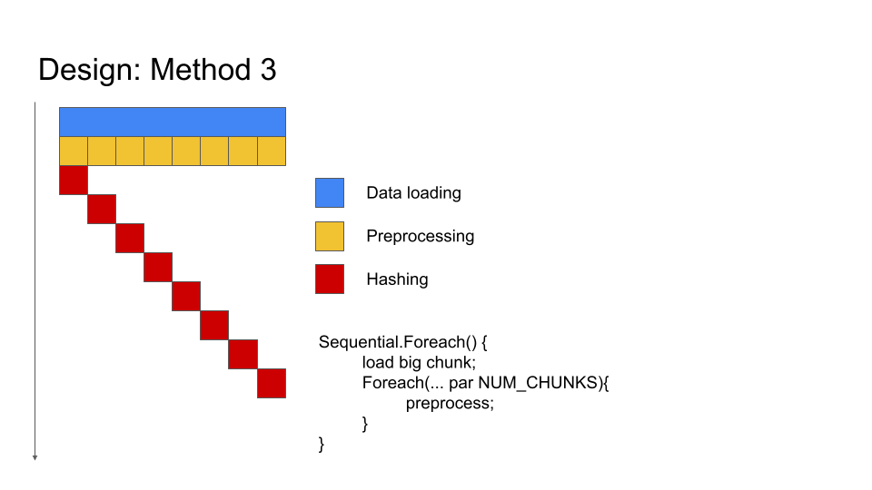

# EE109 Digital System Lab Final Report
Philip Mateo Pfeffer, Raul Gallo Dagir

## Table of Contents
- Application Overview
- Software Simulation
- Hardware Implementation
- Design Tradeoffs
- Appendix

## Introduction
SHA 256 is the most famous crytographic hashing function from the SHA-2 family, which was developed and published by the NSA in 2001. Among other applications in internet authentication and encryption protocols, SHA 256 recently stood out for its key role in transaction verification in blockchain technology. In the cryptocurrency gold rush, miners have been pouring billions of dollars into optimizing the mining algorithm and building custom hardware to increase the hashing rate. Curious about the challenges in scaling up the minig technology and as long time enthuasiasts of cryptocurrencies, we decided that optimizing the SHA 256 hashing algorithm would be a fitting end to our Stanford undergrad career in Electrical Engineering.

## Application Overview
The SHA 256 pseudocode (from Wikipedia's article on SHA 2) has been included below - let's explore how it works. The first step involves initializing the initial hash values and the array of round constants which will be the base of the final hash calculations. Second, the message to be hashed is padded according to certain rules - the hashing algorithm will require the message length to be a multiple of 512. Third, the message will be broken into 512 bit chunks. Each chunk will be used to generate a 64-bit message scheduler array - the first 16 words will be the chunk itself, while the remaining 48 will be derived from the initial 16. Following that, the current value of each hash will be initialized, and the compression loop will be run, iterating through every one of the entries in the message scheduler array, running calculations and subsequently adding the compressed chunk values to the current hash values. After iterating through all the chunks, the final step consists in appending all the hashes together in a single number, and returning that.

Pseudocode:
```
Initialize hash values:
(first 32 bits of the fractional parts of the square roots of the first 8 primes 2..19):
h0 := 0x6a09e667
h1 := 0xbb67ae85
h2 := 0x3c6ef372
h3 := 0xa54ff53a
h4 := 0x510e527f
h5 := 0x9b05688c
h6 := 0x1f83d9ab
h7 := 0x5be0cd19

Initialize array of round constants:
(first 32 bits of the fractional parts of the cube roots of the first 64 primes 2..311):
k[0..63] :=
   0x428a2f98, 0x71374491, 0xb5c0fbcf, 0xe9b5dba5, 0x3956c25b, 0x59f111f1, 0x923f82a4, 0xab1c5ed5,
   0xd807aa98, 0x12835b01, 0x243185be, 0x550c7dc3, 0x72be5d74, 0x80deb1fe, 0x9bdc06a7, 0xc19bf174,
   0xe49b69c1, 0xefbe4786, 0x0fc19dc6, 0x240ca1cc, 0x2de92c6f, 0x4a7484aa, 0x5cb0a9dc, 0x76f988da,
   0x983e5152, 0xa831c66d, 0xb00327c8, 0xbf597fc7, 0xc6e00bf3, 0xd5a79147, 0x06ca6351, 0x14292967,
   0x27b70a85, 0x2e1b2138, 0x4d2c6dfc, 0x53380d13, 0x650a7354, 0x766a0abb, 0x81c2c92e, 0x92722c85,
   0xa2bfe8a1, 0xa81a664b, 0xc24b8b70, 0xc76c51a3, 0xd192e819, 0xd6990624, 0xf40e3585, 0x106aa070,
   0x19a4c116, 0x1e376c08, 0x2748774c, 0x34b0bcb5, 0x391c0cb3, 0x4ed8aa4a, 0x5b9cca4f, 0x682e6ff3,
   0x748f82ee, 0x78a5636f, 0x84c87814, 0x8cc70208, 0x90befffa, 0xa4506ceb, 0xbef9a3f7, 0xc67178f2

Pre-processing (Padding):
begin with the original message of length L bits
append a single '1' bit
append K '0' bits, where K is the minimum number >= 0 such that L + 1 + K + 64 is a multiple of 512
append L as a 64-bit big-endian integer, making the total post-processed length a multiple of 512 bits
such that the bits in the message are L 1 00..<K 0's>..00 <L as 64 bit integer> = k*512 total bits

Process the message in successive 512-bit chunks:
break message into 512-bit chunks
for each chunk
    create a 64-entry message schedule array w[0..63] of 32-bit words
    (The initial values in w[0..63] don't matter, so many implementations zero them here)
    copy chunk into first 16 words w[0..15] of the message schedule array

    Extend the first 16 words into the remaining 48 words w[16..63] of the message schedule array:
    for i from 16 to 63
        s0 := (w[i-15] rightrotate  7) xor (w[i-15] rightrotate 18) xor (w[i-15] rightshift  3)
        s1 := (w[i- 2] rightrotate 17) xor (w[i- 2] rightrotate 19) xor (w[i- 2] rightshift 10)
        w[i] := w[i-16] + s0 + w[i-7] + s1

    Initialize working variables to current hash value:
    a := h0
    b := h1
    c := h2
    d := h3
    e := h4
    f := h5
    g := h6
    h := h7

    Compression function main loop:
    for i from 0 to 63
        S1 := (e rightrotate 6) xor (e rightrotate 11) xor (e rightrotate 25)
        ch := (e and f) xor ((not e) and g)
        temp1 := h + S1 + ch + k[i] + w[i]
        S0 := (a rightrotate 2) xor (a rightrotate 13) xor (a rightrotate 22)
        maj := (a and b) xor (a and c) xor (b and c)
        temp2 := S0 + maj
 
        h := g
        g := f
        f := e
        e := d + temp1
        d := c
        c := b
        b := a
        a := temp1 + temp2

    Add the compressed chunk to the current hash value:
    h0 := h0 + a
    h1 := h1 + b
    h2 := h2 + c
    h3 := h3 + d
    h4 := h4 + e
    h5 := h5 + f
    h6 := h6 + g
    h7 := h7 + h

Produce the final hash value (big-endian):
digest := hash := h0 append h1 append h2 append h3 append h4 append h5 append h6 append h7


```

## Software Simulation 
The software simulation is not too complicated - it is simply an implementation of the pseudocode described above, which can be found on [this url](https://github.com/PhilipPfeffer/sha_hash/blob/main/software_demo/sha.py).

## Hardware Implementation
### Method 1
As a starting point to out implementation, we went through the Bitcoin proof-of-work algorithm posted on the official [Spatial website](https://spatial-lang.org/sha). Bitcoin uses the SHA of a SHA, so we managed to extract a baseline model to serve as a reference and as a starting point. In this preliminary implementation, each 64-byte chunk of data was being loaded and then preprocessed sequentially (i.e. Sequential.Foreach(... par NUM_CHUNKS){ load; preprocess; hash sequentially;}), as the diagram below depicts.



### Method 2
As we started to optimize this base model, we ran into two main obstacles: the compression loop has loop-carried dependencies, which makes it impossible to fully parallelize it, and the data loading/preprocessing was taking a lot of time. We did notice, however, that the preprocessing step could be pulled out of the loop and be executed in parellel as there were no real dependencies. Therefore, on our second design iteration, we parallelized the data loading and preprocessing (i.e. Foreach(... par NUM_CHUNKS){ load; preprocess; hash sequentially; }). This approach limits the size of NUM_CHUNKS to 2 because there are only 4 data loaders on the FPGA (trying the boundary case of NUM_CHUNKS=4 did not work).



### Method 3
Our implementation can be found [here](https://github.com/PhilipPfeffer/sha_hash/blob/0af3815a8bdc9d8e867f387a88384f288a1caa37/scala/sha_preprocessing.scala).

Our third approach loads a larger (64xNUM_CHUNKS-byte) contiguous chunk of data in one go (i.e. Sequential.Foreach() { load big chunk; Foreach(... par NUM_CHUNKS){ preprocess; hash sequentially; }}). Then, each 64-byte chunk (of which there are NUM_CHUNKS chunks) is being preprocessed in parallel. (Note that each chunk must be pre-processed sequentially, but that we are processing multiple chunks in parallel). Here, we show the tradeoff for different values of NUM_CHUNKS=[1,2,4,8]. 



### Method 4
Our implementation can be found [here](https://github.com/PhilipPfeffer/sha_hash/blob/0af3815a8bdc9d8e867f387a88384f288a1caa37/scala/sha_preprocessing_large_data.scala).

A futher optimisation we would like to try is to first load as much data into SRAM as possible (rather than 64xNUM_CHUNKS-bytes). From running VCS simulations for method 3, we know that we can only parallely process up to 8 chunks at a time (64x8 bytes). We implement method 4 by loading a multiple of that amount of data. In other words we load LARGE_NUM_CHUNKS x NUM_CHUNKS x 64 bytes at a time, where LARGE_NUM_CHUNKS is a new hyperparameter to optimise.
    (i.e. Sequential.Foreach(... by LARGE_MULTIPLIERx64xNUM_CHUNKS) { load LARGE_MULTIPLIERx64xNUM_CHUNKS bytes; Sequential.Foreach(...by 64xNUM_CHUNKS){ Foreach(... par NUM_CHUNKS){ preprocess; hash sequentially; }} })

Since we are limited on the parallelisation of the preprocessing by logic utilisation to NUM_CHUNKS=8 (we have not been able to get NUM_CHUNKS=16 to work). However, this does not limit the amount of data we can load. Therefore, we can load as much data as possible first, and then parallely process NUM_CHUNKS 64-byte chunks. This reduces the amount of time spent loading data into SRAM.


TODO:
- Resource utilization for method 3: 8 chunk
- Resource utilization for method 4: 8 chunk, 2 large chunk (whatsapped it to you)
- Table for method 3
- Table for method 4 (whatsapped it to you)

## Design Tradeoffs
```
// Discuss your tradeoffs between the design choices you've made
```

## Appendix
```
// If you have any comments about the class, or have a video you want to show us, 
// feel free to add them in the Appendix.
```
